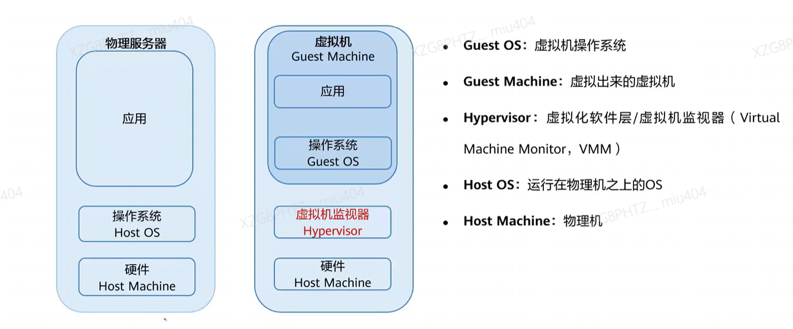

# 云计算基础
## 基础技术
### 计算类技术
#### 虚拟化
##### 什么是虚拟化

- 虚拟化技术可将单台物理服务器虚拟为多台虚拟机使用，多台虚拟机共享该物理服务器的硬件资源。
  - 虚拟机本质上是由磁盘文件和描述文件组成，封装在同一个文件夹中。
  - 服务器上运行多个虚拟机，各自封装，互相隔离，即存在多个文件夹。
  - 这些文件夹又可以存放在底层存储提供的文件系统上，因此实现同一介质可以存放或运行多个虚拟机。
  
- 虚拟化的本质就是将原先的物理设备进行逻辑化，转化成一个文件夹或文件，实现软硬件的解耦。

##### 虚拟化的特点
- 分区，隔离，封装，独立
#### 容器
##### 什么是容器

- 容器是一个标准化的单元，是一个**轻量级、可移植**的**软件打包**技术。它将软件代码及其相关依赖打包，使应用程序可以在任何计算介质中运行。简单来讲，容器就像一个标准化的盒子，能够装很多不同类型的东西，并且装完后能够塞进很多不同类型的柜子里。

### 网络类技术